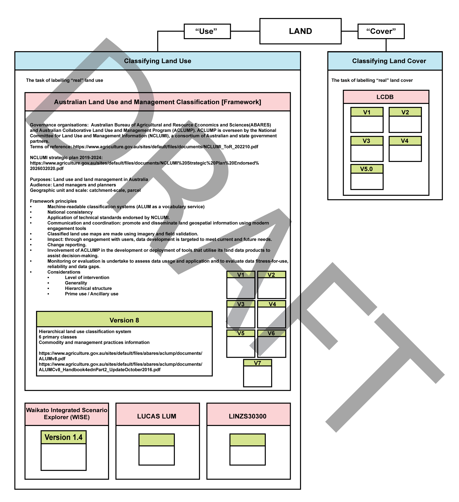
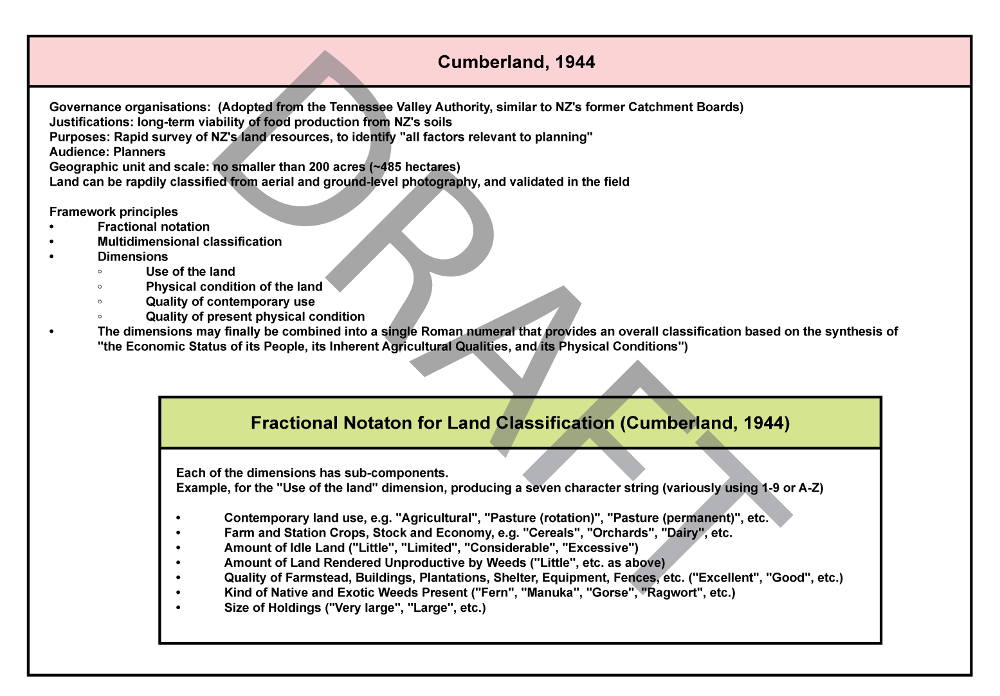

# NZSLUC

**THIS IS AN UNPUBLISHED AND UNREVIEWED DRAFT**

New Zealand currently lacks a comprehensive and cohesive land use information system. There is a lack of consistent definition or approach to mapping land use. Consistent land use information for New Zealand (over space and time) would improve the understanding of the impacts of land use on ecosystem services, support the modelling of the impacts of climate change, and help profile natural disaster risks, among other benefits.

Many land use classifications have been developed for New Zealand, primarily drawing on the same (or very similar) public and commercial data. Few, if any, having been re-used. One of the common reasons for this outcome is that systems tend to narrowly focus and use data that is tightly coupled to one specific application.

We propose that any New Zealand land use classification system adheres to common principles in a common framework.  This document is an initial draft of such a framework.

We propose a **land use classification _framework_** that includes principles and procedures appropriate for any land use classification system (and associated output, i.e. geospatial information and maps). This must allow for multiple land use classifications systems, each with its own intended use cases, potentially across multiple value systems. This may (or may not) include hierarchies for generalisation as well as other types of relational information such as lineage, parts, terminological variation. Multiple hierarchies are important as they will facilitate 1 to 1, 1 to many, many to 1, and many to many relationships as appropriate; even if all that can be captured is that there _is a_ relation between two classes despite not fully understanding how the classes may be related. <!--  --- e.g `skos:related`. -->

We propose that **land use classification _systems_** are developed within this framework. It is at the _system_ level that a more concrete set of classes may be designed. It is unlikely that one classification _system_ will be appropriate for all data or use cases. This allows for the development of multiple systems using a variety of properties, potentially only available at specific spatial or temporal scales, limited extents, or specific purposes (including confidentiality).

# The New Zealand Standard Land Use Classification Framework

The NZSLUC Framework presents principlesa and procedures for designing land use classification systems.

## Principles <!-- Informative -->

1. #### Prioritize Data
1. #### Specificity
    each classification is designed for an explicit spatiotemporal geographic unit
1. #### Hierarchies are encouraged where appropriate
    1. generalization hierarchy (aggregation/disaggregation) 
    1. genealogical hierarcy (lineage) 
1. #### Primary use, ancillary use, and system variablity
1. #### This classification framework is intended to be improved over time
    The classification framework shall be reviewed based on comments and requests of stakeholders.
1. #### Classification systems encourages reproducible and transparent methodologies 
1. #### Classification systems should 

_____________________________________________________________________________________
1. To encourage multidimensional conceptualisations of land use, with particular regard for the following dimensions:
    - Commodities
    - Management practices
    - Tenure

## Procedures <!-- Normative -->

<!-- 1. To balance **reliability, practicality, and cost effectiveness** when determining procedures. -->

The brief list of procedures for land use classification systems under this framework is below. Following subsections add detail.

1. **Validation** Published data shall be independently validated, and quality described using a standard. Overall attribute accuracy of 80% shall be adopted as a minimum standard.
1. **Semantic versioning** Changes made to land use classification systems shall be communicated to users using semantic versioning of the form `major.minor.patch`, e.g. v0.2.4. Once a version has been release, the contents of that version must not be modified; modifications must be released as a new version.
    - Major version for backwards incompatible functionality.
        - Major version 0 is reserved for initial development and tolerance for change is higher than for other major versions.
    - Minor version for new or modified functionality in a backwardly compatible manner.
    - Patch version for backwardly compatible fixes and minor adjustments.
1. **Publication and metadata** Land use datasets shall be maintained on data repositories, and published with standardised metadata.
1. **Stability of geographic scale** Geographic scales and entities are to be considered stable.
1. **The effect of ISO 19144-3** The publication of the ISO 19144-3 standard (_Geographic information – Classification Systems – Part 3 Land Use Meta Language (LUML)_) shall cause a revision of these procedures. This standard is likely to affect the appropriate procedures for land use classification systems.
1. **Compatibility with existing land use classification systems** Compatibility with existing New Zealand classification systems shall be considered. Compatibility with international classification systems may also be relevant.
1. **Definition of land** Classification systems shall individually determine the definition of "land" with reference to their stated purpose.
1. **Mixed and secondary uses** Classification systems shall ensure that mixed or secondary uses may be attributed to land.
1. **Provenance** Source information (i.e. provenance, geographic scale, date, operator, and confidence) shall be recorded.
<!-- Classification systems shall use vocabularies that are available (normatively) as RDF, accessible via SPARQL 1.1 endpoints. -->
<!-- Some procedure for contributing to this framework itself  -->
<!-- Some Ppocedure regarding the standardisation of regional input data? -->

Fig N. Overview figure.

### Validation

A land use product should not be considered complete until an accuracy assessment has been conducted. Errors can be thematic or spatial, and these errors are not independent. Validation should be reported as a confusion matrix of classification classes, such that users can determine that a geographic unit mapped as class _i_ is class _j_ on the ground for any class _i, j_. This assessment requires that a number of known units are compared to their classified values. This assessment should be made on the basis of ground-truth, local knowledge, and aerial imagery (in descending preference order) and shall not be conducted by those involved in the classification proceedure itself.

Recommended procedure (based on ALUM):
1. Determine which classes can be validated. Not all classes in a classification system are assessable. Justifications for excluding a class from validation include:
    1. If land use can only be determined based on tenure rather than physical attributes (typical examples: forms of conservation land; water supply areas)
2. Conduct a stratified random sample strategy should be conducted, using the map classes as the strata; the sample size within each stratum is in proportion to the occurrence of that class in the land use product. The total sample size shall be limited to a fixed number of total assessments (e.g. 1,000). In practice, the sample may be larger; it should increase with the number of classes within the classification system, the number of available validators, and the size of the intended audience.
3. The assessment unit is the same as the geographic unit, e.g. a parcel or cell.
4. Construct an error matrix, comparing land use classes for sampled geographic units with the observed land use classes. Compute the total, user's and producer's accuracies for the map. Also compute 90% confidence intervals for each estimate. (See [[1]](#1).)
5. Determine if the map meets the required level of accuracy. If the _lower bound_ of the confidence interval for total accuracy is greater than this level (**80%**), then the map meets the framework specification. If any of the upper bounds of the user's or producer's accuracies is less than 50%, then the map may also be considered to have failed the specification, however there may be some scope for judgement in certain classes due to unavoidable confusion between similar classes. If validation fails, perform a re-classification focussed on addressing the worst-performing classes, and repeat the validation proceedure for all clases.
6. Report the accuracy, including the error matrix and a map of sample sites.

It is recommended that validation results are made available, conforming to the ISO 19157-1:2023 (Geographic information — Data quality) standard.

### Semantic versioning

### Publication and metadata

Published land use data shall be made available on public data repositories. Exceptions to this may be made for land use classifications with information considered sensitive by those supplying data or interpretative information. However, making data available on a data repositories with privacy controls is still recommended.

One or more established metadata standards shall be used when publishing land use data (whether public or private). Non exhaustive list of examples include:
- The Dublin Core (DCMI)
- DCAT-2 (Data Catalog Vocabulary, version 2)
- ISO 19115 (geospatial metadata standard)

### Stability of geographic scale

Geographic units and geographic scales form an intrinsic part of the specification of a land use classification system, and changes to these are to be considered _major_ version changes to a classification system. The reason for this is that stability in the geographic frame of reference is critical to support analysis of land use change over time.

### The effect of ISO 19144-3

### Compatibility with existing land use classification systems

Compatibility with existing New Zealand classification systems (PAN-NZ for conservation land; ANZLIC for industrial categories; Dairy NZ classes; etc.) shall be considered in the design of classification systems. It shall take the form of published concordances where such associations are possible.

It may also take the form of using an existing classification system within a wider land use classification system; for instance, using PAN-NZ as a classification sub-system for classifying land that is statutorily protected.

This concept extends beyond land use narrowly considered, and extends to land use management practices and lists of commodities. For example, we encourage application of the [New Zealand Farm Data Standards](https://www.datalinker.org) glossaries. 

### Definition of land

Classification systems shall individually determine the definition of "land".

In particular, to what extent it includes marine and terrestrial water bodies.

This is also relevant for land use classification systems to declare their appropriate extent of application. For example, whether a land use classification system should be applied to New Zealand's offshore islands, marine areas (out to the EEZ), the entire continental shelf, etc. There is no consensus that a definition of "land" can exclude uses such as aquaculture, marine conservation areas, fishing areas, mining permits, shipping lanes, etc., particularly in the notable absence of "sea use maps".

This also allows for classification systems that are developed for particular application to the _rohe pōtae_ of iwi but may be inappropriate elsewhere.
___________________________________________________________________
<!-- ~~copied directly~~ modified from from Cavanagh and Whitehead 2023 -->
‘Land use’, ‘land cover’ and ‘land management’ are often used interchangeably in discussions about land use. This erroneous use seems to largely stem from a lack of awareness of the distinct meaning of each of these terms.  The following definitions, which have been drawn from the [Australian Department of Agriculture, Water and the Environment](https://www.awe.gov.au/abares/aclump/definitions), help to make explicit the differences. 
- Land cover refers to the physical surface of the earth. This may include vegetation types, naturally bare surfaces (e.g., exposed rock, permanent snow and ice, etc.), and water bodies. This may also include anthropogenic elements, such as transport infrastructure, built environments or agriculture. Land cover can usually be determined by observable patterns via remote sensing, aerial imagery, etc. 
- Land use means the purpose to which the land is committed. This may include:
    1. the production of goods---e.g. crops (agronomy?), timber, manufacturing...
    1. services---e.g. defence, recreation, biodiversity, natural resources protection...
    1. place of spiritual connection
    1. sacred
- Land management practice refers to the approach taken to achieve a land use---e.g. cultivation practices, stocking rate density, etc.). 
- Land use classification may provide general information on land cover, and the types of human activity involved in land management.  
<!-- end copy -->

### Mixed and secondary uses

Some classification systems are intended only to capture "primary" land use for geographic entities, typically defined in economic terms. Some classification systems allow for the encoding of multiple uses, but in such a way that information about the primary land use is lost. (For example, the _ratings valuation rules_, LINZ S30300, allow for "multiple use" classes without the ability to encode the component uses.)

Data schemas for land use classification systems produced under this framework shall be designed in such a way that multiple uses can be recorded, without loss of information. This may be as a primary/secondary distinction, an enumeration, or some other form of attribution; but it must be possible in some fashion. 

### Provenance

The value of land use data is enhanced when information is available regarding provenance. This relates to the epistemological foundation of land use data: how it is that we know the land use. Within the data schema of a classification system, it must be possible to record provenance information, including (but not limited to) if applicable:
    - the geographic scale of any input data
    - the publication or (preferably) feature-level creation date of any input data features
    - the operator (who is performing the classification; or who has decided on the appropriateness of a particular class label for a feature)
    - a quantitative (e.g. probabilistic) or qualitative (e.g. operator confidence) measurement of confidence in the applied class

## Matrix framework

Following [[2]](#2)

| Dimension used in classification| Individual or group information - extended family (Whānau) or individual (highly sensitive or personal information) | Māori databases such as the iwi or hapū tribal level (secured protection of information) | Regional and district databases, such as local government (conditions and criteria required for storing confidential information) | National level, central government (national databases, public domain access) |
|:---|:---|:---|:---|:---|
| Flora and Funga | Plant uses, plant varieties, medicinal plants, plants for weaving etc. | Local information on vegetation types | Regional or district data on vegetation and land use | National or regional data on vegetation (land cover) |
| Fauna | Special fauna, such as special foods, cultural arvest, fishing grounds, etc. | Local information on fauna | Regional or district data on fauna | National or regional data on fauna |
| Land, soil | Special landmarks, land features, traditional knowledge on soils and cultivation, muds/dyes for weaving, etc. | Tribal information on land features, landforms, soils, etc. | Regional or district data on landforms, soils, etc. | National or regional data on landfrosm, soils etc. |
| Water | Detailed or confidential information on water | Tribal information on water | Regional or district data on water | National or regional data on water |
| Air | Detailed or confidential information on air | Tribal information on air | Regional or district data on air | National or regional data on air |
| Special places | Detailed or confidential information on special places, cultural and historic sites | Tribal information on special places, cultural and historic sites (such as archaelogical sites) | Regional and district information on special places, cultural and historic sites | Limited information on special places, cultural sites |
| Sacred sites | Detailed or confidential information on sacred sites (e.g. burial grounds) | Tribal information on sacred sites | Regional and district information on some sacred sites (generalised information) | (Little or no information at this scale) |
| Metaphyiscal | Detailed or confidentail metaphysical information (such as spiritual, cosmological) | Tribal information on metaphysical information | (No information at this scale) | (Little or no information at this scale) |

---

## Definitions / Key Concepts

| Concept | Description | Reference(s) |
|---------|:-----------:|-------------:|
| Land use | The purpose to which land is committed by people. This includes the production of goods and services, as well as more `passive' uses such as conservation, scenery, and rehabilitation. | ... |
| Tenure | The form of an interest in land. Refers too types of property (land) ownership, including freehold, leashold, unit title, cross lease, etc. and also relates to the questions of who owns land (Crown, iwi, private) | ... |
| Commodity | A product. | ... |
| Management practice | A practice. | ... |

---

<!-- Normative -->

# Land Use Classification Systems

This is a list of land use classification systems that are (being) developed under this classification framework. 

| Name | Link | Intended purpose |
|------|------|------|
| TBD  | [🔗](classification-systems/nzslucs.md) | General environmental change, especially for freshwater monitoring and greenfield development |

Fig N. a worked example...

# References
<a id="1">[1]</a>
Denham, R. (2005).
Accuracy assessment for land use mapping.
Queensland Department of Natural Resources and Mines, Brisbane, and the Bureau of Rural Sciences, Canberra.

<a id="2">[2]</a>
Harmsworth, G. (1999).
Indigenous values and GIS: a method and a framework.
Business Alert 14.1 (1999): 10-15.