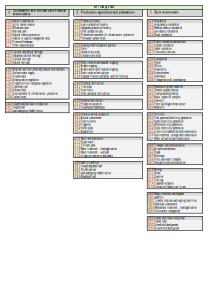

# New Zealand Land Use Management (NZLUM) classification system 

Status: Draft
Version: 0.3
Developed by: Manaaki Whenua – Landcare Research

> Kotahi te aho ka whati, ki te kāpuia e kore e whati.
>
> One strand of flax is easy to break, but many strands together will stand strong.
> 
> — Kīngi Tāwhiao

NZLUM is adapted from the Australian Land Use and Management (ALUM) classification (version 8) for application in New Zealand, taking into account common land-use classification usage in New Zealand for several different purposes, including SOE soil quality monitoring (see Cavanagh & Whitehead 2022, 2023)[^1][^2], the Waikato Integrated Scenario Explorer (Rutledge et al. 2016)[^3], Greater Wellington Regional Council whaitua (catchment) classifications (Cavanagh 2022), Land Use Database version 4 (LUDB4) (Price et al. 2010)[^4], the New Zealand Planning Standards (MfE 2019)[^5], and LINZ rating valuations rules (LINZ 2010) [^6].

The rationale for the adaptation of ALUM is that ALUM provides a useful data structure and platform for standardisation, which, simply put, avoids some reinvention of the wheel in this regard. ALUM is licensed under a [Creative Commons Attribution 3.0 Australia Licence](https://creativecommons.org/licenses/by/3.0/au), which explicitly permits adaptation of ALUM. Where direct overlap of an ALUM class is considered appropriate, it has been retained. However, both particular classes and the arrangement of the class hierarchy are significantly different, and additional classes have been added to reflect what we consider to be relevant considerations for land-use information in New Zealand.

The two biggest changes from ALUM are the removal of consideration of irrigation as a demarcation between two primary classes of agriculture, and the removal of water as a primary class. We considered ALUM’s division and duplication of classes according to irrigation status to be redundant, given that irrigation (status and type) can be recorded as a management practice, and that retaining it would impede usability. We also modified the primary intensive-use class to separate intensive agricultural production from other intensive land uses and included these within the primary agricultural production class.

The other major difference is the absence in NZLUM of a water primary class. We have done this not because we consider water unimportant or out of scope, but rather because we consider water to be a land cover, not a land use. We propose an attribute to capture the presence of water using a controlled vocabulary of terms for water features (such as `river`). In this way, end-users can control the inclusion or exclusion of water features.

Certain land uses can only occur on water (e.g. aquaculture and fisheries); some can occur on either land or water (e.g. oil and gas infrastructure), or at the interface of land and water (ports and wharves); and obviously many land uses can only occur on land (e.g. pastoral farming), but, even then, pieces of such land may include water (e.g. dams, ponds, and lakes), or affect water (irrigation water take consents, tailings, and pollution). ALUM classifies water as a primary class but admits that this presents some difficulty. One proposal for NZLUM is that water be recorded as a distinct attribute that can be applied to a geographical unit.

Currently there is inconsistency in our proposal with respect to how water features should be captured; see, for instance the water features under class 2 (Production agriculture and plantations) and class 3 (Built environment). This inconsistency should be resolved before applying this draft classification system, because a final decision about the treatment of water will affect future organisational changes to the classification system. Water also has a special status for Māori, and engagement with iwi/Māori in the further development of this classification system is required. Here we do make the case that including water as a land cover attribute, rather than a class, does have merit.

Following the pattern of ALUM attributes (for commodities and management practices), we propose that a water attribute should have an associated, controlled set of terms that could be applied to a geographical unit. An incomplete short list (using English language terminology) is:

- `lake`
- `reservoir`
- `dam`
- `evaporation basin`
- `river`
- `channel`
- `aqueduct`
- `wetland`
- `estuary`
- `intertidal`
- `marine`

Subtypes could be used to disambiguate where information allows. For example, just as the list of commodities allows for either `cattle` (i.e. unspecified) and `cattle dairy`, `cattle beef`, `cattle meat` to accommodate some additional information, one could imagine the use of `marine inshore`, `wetland stormwater`, and `wetland bog`. The parallel or exclusive use of te reo Māori terms could be helpful to create subtypes along dimensions that are important to Māori, and adds the potential for localism and flexibility on top of the classification system as it pertains to water. (Treating water as a primary class would not allow this to the same extent.)

Overall, this draft classification system is proposed as a ‘general purpose’ land-use classification in the context of grouping the nature of interaction of land-use activities with the use of soil and water resources relevant for land-use change modelling or environmental management. The development of the system will allow for some end-user reclassification of land use (e.g. on the basis of irrigated vs non-irrigated land to meet alternative purposes), although in other cases (e.g. for LUCAS LUM) and the specification of pre-1990 forest, or to better reflect te ao Māori values, additional classification systems would still more than likely be required.

The present classification system retains ALUM's practice of attempting to record additional information (e.g. land management practices) using defined terminology. The additional information – termed ‘attributes’ – is related to, but independent of, the land-use classes themselves.

The collection of specific additional attributes is intended to allow for the reclassification of land use based on these attributes, which may be able to be determined at the time of mapping, or recorded after the fact. The number and type of attributes captured within this system needs to be agreed in order to recognise the value of the information, and the context of use within this classification, versus the use of an alternative classification. These attributes are optional, but they should be included where information permits.

Potential attributes could include the following.

- **Commodity**  (as in ALUM): captures information about crops and livestock that allows for further distinction within a land-use class and may be useful in the context of biosecurity, economic modelling, nutrient modelling, greenhouse gas estimation, site-selection, etc.
- **Management practices** (as in ALUM): captures additional information not otherwise captured in the class hierarchy, such as irrigation, crop pasture rotations, free range stock, or wintering off of dairy stock. ALUM maintains a list of 44 management practices with agreed names (a controlled vocabulary, or enumeration – a set of named constants). This set of names was compiled from existing sources, such as the Australian Bureau of Statistics, Meat and Livestock Australia, Horticulture Innovation Australia, Grains Research and Development Corporation, and state and territory lists. We propose adopting this list but making minimal extensions where necessary (dairying wintering off practice is an obvious extension that we recommend). Management practices are expected to apply only to particular land-use codes, so they must be used in conjunction with these codes. Going beyond the ALUM practice, in the built environment this attribute could be used to include information such as building materials or floor levels.
- **Tenure**: relates to the potential for changes to land use and land-use management practices (because tenure may constrain possible land-use changes). Information relating to land tenure could be captured in two attributes: `land_estate` and `land_status`. How land is owned, and by whom, is an important consideration for how land may be used or managed. Recognising that tenure is an extension of the considerations of ALUM (on which this classification system is based), it is important to note that Boffa Miskell Limited (2023) identified the need for land tenure status as a requirement for a land information system to address the needs of councils to monitor and implement freshwater regulations, and to map urban growth.
- **Zoning**: such as that described in the 2019 New Zealand Planning Standards (e.g. rural zone, Māori purpose zone) will help to identify future land-use changes and can be matched with additional information such as land-cover information to confirm current use. Once again, the need for zoning information as a dimension of land information was identified in Boffa Miskell 2023; it is especially relevant for councils considering patterns of urban expansion and intensification.
- **Land cover**: this is particularly relevant in the context of identifying crop rotations within various primary production classes. These would probably be framed as land cover at the time of mapping. There would need to be further decisions regarding the appropriate land-cover terminology, so this idea has not progressed beyond an initial proposal.
- **Permeability**: whether land is considered ‘sealed’ or ‘unsealed’. This allows further delineation within classes, particularly in the built environment, which probably contains mixtures of sealed and unsealed land (e.g. in residential areas and road corridors).
- **Water**: as discussed above.

It is worth noting that all these attributes are categorial and not continuous variables. There may be a need to include additional continuous variables (such as farm stocking rates in stock units per hectare). However, these should be appropriately discretised or otherwise captured as ancillary information so that the total number of combinations of all attributes can be enumerated.

Land is classified according to its primary use, based on the primary land management objective of the landowner or manager, and additional ancillary land uses can be captured separately. Some uses may only ever be ancillary, so the proposed classification system necessarily includes some such uses.

An overview of the class hierarchy is provided below, with further details of the different classes following.

1. **Conservation and minimal use of natural environments**

    This class includes land that has a relatively low level of human intervention. The land may be formally reserved by government for conservation purposes, or conserved through other legal or administrative arrangements. Areas may have multiple uses but nature conservation is a central consideration. (Some land may be unused because of a deliberate decision of the government or landowner, or due to circumstances).

    **Where a classification is based on information about legal protection, the relevant information (e.g. the Act) should be mentioned in the `comment` field.**

    Areas with lower levels of biodiversity protection are anticipated to have other primary uses, but biodiversity protection ranking could be captured as an ancillary use with class 1.1.4 and 1.1.5.

    

Expand

    1. **Nature conservation**

        Nature conservation classes are determined by the classification scheme adoted for the Protected Areas Network of New Zealand (PAN-NZ).

        1. **Strict nature reserve**
            Protected area managed mainly for science. An area of land possessing outstanding or representative ecosystems, geological or physiological features or species, which is available primarily for scientific research and/or environmental monitoring. (IUCN 2008 Category Ia.)
        
        2. **Wilderness area**
            Protected area managed mainly for wilderness protection. A large area of unmodified or slightly modified land, retaining its natural character and influence, without permanent or significant habitation, which is protected and managed so as to preserve its natural condition. (IUCN 2008 Category Ib.) 
        
        3. **National park**
            Protected area managed mainly for ecosystem conservation and recreation. A natural area of land, designated to: a) protect the ecological integrity of one or more ecosystems for the current and future generations; b) exclude exploitation or occupation detrimental to the purposes of designation of the area; and c) provide a foundation for spiritual, scientific, educational, recreational and visitor opportunities, all of which must be environmentally and culturally compatible. (IUCN 2008 Category II.)
        
        4. **Natural feature protection**
            Protected area managed for conservation of specific natural features. An area containing one or more specific natural or cultural features that are of outstanding value because of their inherent rarity, representative or aesthetic qualities, or cultural significance. (IUCN 2008 Category III).
        
        5. **Habitat or species management area**
            Protected area managed mainly for conservation through management intervention. An area of land or sea subject to active intervention for management purposes to ensure the maintenance of habitats or to meet the requirements of specific species. This may include areas on private land. (IUCN 2008 Category IV.)
        
        6. **Protected landscape**
            Protected area managed mainly for landscape conservation and recreation. An area of land where the interaction of people and nature over time had produced a distinct character with significant aesthetic, cultural or ecological value, and often high biodiversity. (IUCN 2008 Category V.)
        
        7. **Other conserved area**
            Land under forms of nature conservation protection that fall outside the scope of the CAPAD classification. This includes heritage agreements, voluntary conservation arrangements, registered property agreements, and recreation areas with primarily native cover (if the recreation area is primarily cleared or non-native cover assign to 3.2.1 ‘Outdoor recreation’).

    2. **Cultural and natural heritage**

        Conservation classes are for purposes other than biodiversity protection.

        1. **Indigenous cultural heritage**
            e.g. historical pā sites, New Zealand land wars sites, DOC Māori sites
        
        2. **Cultural heritage**
            e.g. historical mining sites, selected DOC ‘iconic sites’ and Toru Whenua landmarks
        
        3. **Natural heritage**
            protected areas for the conservation of specific natural features, and landscapes (e.g. Waitaki Whitestone Geopark, Banks Peninsula Geopark).
    
    3. **Minimal use from relatively natural environments**

        This class includes land that is subject to relatively low levels of intervention or that is largely unused in the context of prime use or use for resource protection. This land may be covered with indigenous or exotic plant species. It includes land where the structure of the native vegetation generally remains intact despite deliberate use, although the floristics of the vegetation may have changed markedly (e.g. grazing on native tussock land).

        Where native grasses have been deliberately and extensively replaced with other species, 
        the land use should not be classified under class 1.

        1. **Surface water supply** – an area managed as a catchment for water supply.
        
        2. **Ground water** – an area managed as an aquifer recharge zone.
        
        3. **Grazing native vegetation** – land uses based on grazing by domestic stock on native vegetation where there has been limited or no deliberate attempt at pasture modification. This captures high-country farming with domestic stock grazing on native vegetation where there has been limited or no deliberate attempt at pasture modification. Some change in species composition may have occurred. This is probably limited to South Island high-country farms. Verification (e.g. assessment of vegetation on grazed land) to assess the extent of modification is required. ALUM specifies this class when there is greater than 50% dominant native species, although this criterion needs to be confirmed as being appropriate in a New Zealand context.
        
        4. **Production from indigenous vegetation** – commercial production from retained native forests and related activities on public and private land. This class includes wood production forestry on native timber without clearfelling, and other native forest production (non-sawlog or non-pulpwood production, including oil, wildflowers, firewood, fenceposts, and mānuka/kānuka honey).
        
        5. **Customary use** – natural environments associated with traditional and sustainable indigenous food-gathering practices (mahinga kai). This is often an ancilliary use; this class should only be assigned if the collection of food or other customary use is indeed the prime use of land. (This may include land zoned for Māori purposes, and should only describe contemporary, not historical, use.)
        
        6. **Defence land** – natural areas allocated to field training, weapons testing, and other field defence uses, predominantly in rural areas (e.g. Kaipara Air Weapons Range and the Waiouru Military Camp). Areas associated with buildings or more built environments on defence land are captured under an urban class.
        
        7. **Environmental & infrastructure protection** – land, usually under vegetative cover, used for non-production or environmental purposes (e.g. prevention of land degradation, windbreaks, shade, and shelter). This is not limited to indigenous vegetation. This class includes land with a primary purpose of flood management (e.g. stop banks, spillways). Land that has been planted for the purposes of environmental and infrastructure protection should be captured under 2.1.4. Planted environmental & infrastructure protection.
        
        8. **Carbon forest** – retained (non-planted) indigenous vegetation set aside for carbon credits.
    
    4. **Unused land and land in transition**

        Corridors and roadside areas may fit under this class, along with unused land (in the sense of productive, conservation or urban use), such as cliffs, rock faces, boulders, and tors, where there are relatively low levels of disturbance. It does not include land undergoing natural succession in the context of changing plant species.

        Delineation between indigenous and exotic vegetation for the minimal use and unused\ land and land in transition classes can be made by reference to land-cover information.

        1. **Unused land** – includes land that is unusable for productive agriculture or urban uses, such as cliffs, rock faces, boulders, and tors, where there are relatively low levels of disturbance.
        
        2. **Land undergoing rehabilitation** – degraded land (e.g. due to erosion or flood damage) that is being actively rehabilitated through planting with indigenous or exotic species to return land to a natural state. This includes riparian plantings.

    

2. **Production agriculture and plantations**

    This class includes land used principally for primary production, where native vegetation has largely been replaced by introduced species through clearing, the sowing of new species, the application of fertilisers or the dominance of volunteer species. The range of activities in this category includes plantation forests, pasture production for stock, cropping and fodder production, and a wide range of horticultural production. If there is evidence of irrigation infrastructure or water-take consents, land should have irrigation listed as a management practice, even if it appears that irrigation water has not been recently applied.

    Fallow or ploughed land should be assigned to the most likely land use based on the dominant activity conducted in comparable nearby areas or other available evidence. Fallow or ploughed land should be allocated to the relevant pasture, cropping or horticultural class (rather than using land in transition). The fallow or ploughed status should be recorded in the management field.

    

Expand

    1. **Plantation forests**

        This is land on which plantations of trees or shrubs (native or exotic species) have been established (i.e. planted) for production, or environmental and resource protection purposes. This includes farm forestry and may consist of monocultures or mixed species. Specific additional attributes that could be captured are plantation age, rotation number, and species.

        1. **Exotic plantation forestry** – an area managed for pulpwood or saw-log production (exotic species).
        
        2. **Indigenous plantation forestry** – an area managed for pulpwood or saw-log production (native species).
        
        3. **Other production uses** – an area managed for non-pulpwood production, including oil, wildflowers, honey (e.g. kānuka/mānuka plantations).
        
        4. **Planted environmental & infrastructure protection** – an area managed for environmental and indirect production uses (e.g. prevention of land 
        
        5. **Permanent carbon forest** – an area planted with indigenous or exotic trees for the purpose of gaining carbon credits (carbon farming).

    2. **Grazing modified pasture systems**

        This class includes grazing pasture and/or forage, both annual and perennial, based on significant active modification or replacement of the natural vegetation. Land under pasture at the time of mapping may be in a rotation system, so that at another time the same area may be, for example, under cropping.

        The ability to distinguish between dairy and dry-stock production is provided by including the relevant commodity information, such as `cattle dairy`, `cattle beef`, `sheep wool`, `sheep meat`, etc. Multiple commodities should be recorded if appropriate. Crops used in rotation should also be recorded as commodities, if known.

        Dairy support is land that is used to support non-lactating dairy stock (dry cows, heifers and calves). It will include any feed required, and will often include winter crops and potentially summer crops (location/irrigation dependent), along with cereal crops, such as maize, barley, and wheat. It can also include feed that is cut and carried to the milking platform. Dairy support land that is not actively used for grazing should be classified as an arable use.

        1. **Dairy** – the land on which milking cows (or other stock, such as goats or sheep) are grazed during the milking season. Dairy production systems can include rotations of grazed forage crops and maize for silage, and dry-stock grazing, but this class should only be used where dairy is the primary purpose of the land. Where the land is permanently used for dry- stock grazing, it should be classified under dry-stock land use.
        
        2. **Intensive dry stock** – includes non-milking platform pasture where there is a high level of inputs from fertiliser, water requirements (i.e. may be irrigated), and high stocking rates. This is most likely to occur on flat/rolling terrain. Land used for high-intensity dry-stock grazing may include rotations for arable or winter forage crops, as well as grazing of non- lactating (dry) dairy cattle, beef cattle, sheep, and cattle breeding. Grazing of other stock, including deer, goats, and horses, should be captured under class ‘2.2.3 Extensive dry stock’.
        
        3. **Extensive dry stock** – as for class 2.2.2, but for grazing on modified pastures with relatively fewer inputs, lower likelihood of irrigation, and lower stocking rates. This is more likely to take place on hill, hard-hill, or high-country terrain. Grazing livestock other than dairy, sheep or beef should usually be captured in this class (though it does not exclude sheep or beef), and the commodity type appropriately recorded. Where there is a high proportion of indigenous vegetation for grazing land, land use should be classified as grazing native vegetation. Arable or winter forage crops are unlikely to be common rotations in this land-use category.

    3. **Short-rotation and seasonal cropping**

        This class includes agricultural practices characterised by the cultivation of crops with rapid turnover cycles and seasonal planting patterns, typically optimised for efficient land use and high-yield production. This class encompasses agricultural activities such as the cultivation of fast-growing crops such as maize, barley, and certain vegetables, often rotated on short-term cycles to maintain soil health and maximise productivity. Arable, and mixed livestock cropping, integrating both crop cultivation and animal husbandry, is also included in this class.

        If the type of crop is known, record this in the commodity field. For mixed arable and livestock operations, both commodities should be captured as the primary commodity (neither is ancillary).

        1. **Arable cropping** – predominantly grain, seed, or fodder crops; over time it may include vegetable rotations. Includes maize, barley, wheat, peas, other grain and seed crops, and fodder crops. May be used for dairy support (which should be recorded as a management practice if this is known). If the crop type(s) is (are) known, record it (them) in the commodity field using the commodity list.
        
        2. **Arable and mixed livestock cropping** – predominantly grain, seed, or fodder crops; over time it may include short-term (c. 1–3 years) pasture and livestock rotations, and/or vegetable rotations. Pasture and livestock rotations may occur less than 50% of the time. Includes maize, barley, wheat, peas, other grain and seed crops, and fodder crops. May be used for dairy support (which should be recorded as a management practice, if this is known). If the crop type(s) is (are) known, record it (them) in the commodity field using the commodity list.
        
        3. **Short-rotation horticulture** – crop plants living for _less than 2 years_ that are intensively cultivated, usually involving a relatively high degree of nutrient, weed, and moisture control. Predominantly rotations of vegetable crops or seasonal fruits grown for human consumption; may include livestock rotations, but this is considered less likely.
        
        4. **Seasonal flowers and bulbs, and turf farming** – agricultural practices focused on the cultivation of seasonal ornamental flowers, bulbs, and turf grass for commercial purposes. This class encompasses activities such as the cultivation of flowers and bulbs for seasonal markets, landscaping, and turf-farming for sports fields, lawns, and recreational areas.

    4. **Perennial horticulture**

        This class includes crop plants living for more than 2 years that are intensively cultivated, usually involving a relatively high degree of nutrient, weed, and moisture control. Management practices such as irrigation or netting to protect crops from hail or birds can be recorded as management practices. Crop type can be recorded as the commodity and used to identify key crops (e.g. kiwifruit, avocados, and grapes).

        1. **Tree crops** – includes long-term cultivated plants, typically trees or woody shrubs, grown for their fruits, nuts, or other edible parts. These crops require intensive management practices aimed at ensuring optimal growth, productivity, and quality over multiple years. Examples include orchard fruits such as olives, apples, oranges, and apricots, as well as tree nuts such as hazelnuts, macadamias, and chestnuts, which should be recorded in the commodity attribute, if known. Management practices may include pruning, pest and disease control, irrigation, and harvesting techniques specific to tree crops.
        
        2. **Vine fruits** – includes fruit-bearing plants that grow on vines or trailing stems, often requiring support structures such as trellises or arbours. These plants produce fruits that typically hang from vines and may include grapes, kiwifruit, and passionfruit. Vine fruit cultivation involves specific management practices such as pruning, training, trellising, and pest and disease control specific to vine plants.
        
        3. **Other perennial horticulture** – encompasses perennial plants beyond tree crops and vine fruits, such as berries (e.g. strawberries, blueberries), perennial herbs (e.g. lavender, rosemary), and ornamental perennials (e.g. roses, lilies).

    5. **Intensive horticulture**

        This class includes intensive forms of plant production, often with special-purpose improvements used for horticultural production. If crop type is known, record this in the commodity field. Similarly, management practices such as hydroponic systems should be captured when known.

        1. **Production nurseries** – specialised intensive horticultural facilities dedicated to propagating and growing plants for commercial purposes. These nurseries focus on cultivating a wide range of plant species, including ornamentals, fruit trees, and shrubs, typically for landscaping, reforestation, or ornamental purposes. Nurseries may be outdoor (exposed) or under cover. Production nurseries may employ advanced techniques such as grafting, tissue culture, and controlled environment systems to optimise plant growth and quality.

        2. **Glasshouses/shadehouses** – controlled-environment structures utilised within intensive horticulture for protected cultivation of plants, including both vegetable and floriculture production. Glasshouses provide a transparent enclosure, typically made of glass or plastic, allowing natural sunlight to penetrate while shielding plants from adverse weather conditions. Shadehouses utilise shade cloth or netting to regulate light exposure and temperature levels. These structures enable year-round production of a wide variety of crops, including vegetables, herbs, flowers, and ornamental plants.

    6. **Intensive animal production**

        This class covers intensive forms of non-pastoral animal production, livestock production facilities or animal-holding yards. The animal type can be recorded as a commodity. The management field can be used to record practices such as free range or organic. Further development of this category is likely to be required to ensure it is fit for purpose.

        1. **Intensive animal containment** – facilities or systems designed to confine and manage animals, often including feed lots, pens, dairy sheds and yards, and herd homes where animals are raised intensively for meat production or other purposes.

        2. **Poultry farms** – specialised facilities dedicated to the intensive production of domestic fowl, including chickens, turkeys, ducks, and geese, typically for meat or egg production.

        3. **Piggeries** – facilities designed for the intensive rearing of pigs, where large numbers of pigs are housed and managed for meat production.

        4. **Horse studs** – establishments focused on the breeding and raising of horses, typically specialising in selective breeding for desirable traits.

        5. **Aquaculture** – the controlled cultivation of aquatic organisms, such as fish, molluscs, or algae in natural or artificial environments, typically for food production, but also for stock feeds, pharmaceutical uses, biofuels, etc.

    7. **Water and wastewater**

        This class captures built water features associated with agricultural use.

        1. **Stock water** – reservoirs or farm dams on agricultural land for the purpose of supplying drinking-water for stock.

        2. **Effluent pond** – effluent ponds typically associated with dairying.

        3. **Water treatment – land application** – land used for effluent disposal, probably an ancillary use where some form of grazing is the primary use.

        4. **Water treatment – wetland** – constructed or natural wetlands used to improve water quality prior to discharge.

        5. **Irrigation reservoirs and canals** – land used for water storage, management or distribution intended for agricultural purposes; artificial or natural areas allocated for irrigation for agricultural purposes.

    8. **Land in transition**

        As a subclass of ‘Production agriculture and plantations’, land categorised under this class must recently have been used for agriculture or plantations. In the case of greenfield development, where it is known that the land use is in transition to a built-environment category (e.g. due to a zoning change), classify the land under 3.9.0 ‘Vacant and transitioning land’, or a further subclass thereof.

        1. **Unused degraded land** – unused land that is degraded through erosion or flood events that is not being rehabilitated. Can include contaminated land.

        2. **No defined use** – land cleared of vegetation and where the current proposed land use is unknown.

        3. **Land undergoing rehabilitation** – land in the process of rehabilitation for agricultural production (e.g. after significant flooding), and which is actively being recovered.

        4. **Abandoned land** – land where a previous pattern of agriculture may be observed but that is not currently under production, but not due to physical land degradation.

    

3. **Built environment**

    This class captures land uses that involve high levels of interference with natural processes, generally in association with the built environment of closer settlement and supporting infrastructure. The level of intervention may be high enough to completely remodel the natural landscape – the vegetation, surface and groundwater systems, and land surface.
    
    However, land used for active recreational purposes and/or tourism (e.g. mountain bike parks) outside of urban areas and that are not captured in other land-use categories may be captured under the ‘Outdoor recreation’ category, which is a subclass of the built environment, though may still retain much natural character.

    

Expand

    1. **Residential**
        
        This captures land uses primarily designated for private, long-term human habitation, encompassing a variety of housing types and densities.
        
        The following subclasses are proposed. Some alignment with the National Planning Standards (Zone Framework Standard) (MfE 2019) has been considered in the development of these classes. This information (as at time of classification) should be captured in the zone attribute to allow for some reclassification and specification.
        
        The class includes holidays homes, retirement villages, student hostels and other forms of low-turnover or longer-term accommodation, even if these are run commercially. Shorter- term forms of accommodation (motels, hotels, holiday parks, etc.) are captured under ‘3.3.0 Commercial’ or ‘3.3.3 Hospitality’

        1. **High-density residential** – areas characterised by a high concentration of housing units per unit of land area, typically in multi-storey buildings or high-rise developments, often found in urban centres supporting high population density.

        2. **Medium-density residential** – areas featuring a moderate concentration of housing units per unit of land area, typically in the form of townhouses, semi-detached, terraced, or low-rise apartment buildings, often situated in suburban or semi-urban settings in large cities, or central areas of provincial towns. Alignment to the Medium Density Residential Standards (MfE 2022) should be considered.

        3. **Low-density residential** – residential properties within urban boundaries that fall within large-lot or low-density residential zones and are often single-family, one- to two- storey houses with yards and landscaping and lower population density.

        4. **Rural residential** – residential properties with low-intensity (non-commercial) land management practices (e.g. hobby farms) on land in rural or peri-urban areas. Typically featuring larger parcel sizes amidst agricultural or natural surroundings. Concordant with the ‘Rural lifestyle zone’ from the Zone Framework Standard.
    
    2. **Public recreation and services**

        This land-use type includes land designated for recreational facilities and community amenities, serving the recreational needs and essential functions of the local population.

        1. **Outdoor recreation**
        
            Land areas dedicated to leisure activities conducted in natural or semi-natural settings, such as parks, trails, beaches, sportsgrounds, camping grounds, zoos, botanic gardens, recreational reserves, sports grounds, tourist parks, mountain bike parks, etc. with a primary purpose of recreation and culture and typically with considerable unsealed vegetated areas.
        
            These often cater to activities such as tramping, cycling, picnicking, and wildlife observation.
            
            Parks or reserves with a high level of native bush or that are protected areas should be classified under class 1.
            
            The specific identification of this land is intended to enable more ready identification of urban green space. However, this category may also be used to identify recreational areas that fall outside urban boundaries, such as mountain-bike parks.

        2. **Indoor recreation** – facilities designed for recreational activities conducted within enclosed or semi-enclosed structures, including sports centres, gyms, fitness clubs, swimming pools, and indoor sports arenas.

        3. **Community services** – land used for providing essential services and facilities to support the local community, including educational institutions, public healthcare facilities, libraries, museums, courts, prisons, civic buildings, emergency services, marae, religious buildings, cemeteries, and other public amenities for community functioning and well-being

    3. **Commercial**

        This land-use type includes land in a built environment context that is used for private- sector economic activities, encompassing various sectors such as retail, office, hospitality, entertainment, healthcare, transportation, and warehousing. Central government offices when these are privately rented should be captured in this category, even if they are public-facing.

        1. **Retail** – areas used for the sale of goods and services directly to consumers, including shops, supermarkets, shopping malls, convenience stores, suburban dairies, and other retail outlets.

        2. **Office** – land and buildings primarily used for administrative, professional, or managerial activities, including corporate offices, professional services, financial services (banks), government buildings, business parks, and coworking spaces.

        3. **Hospitality** – land and buildings providing accommodation, food, and beverage services to the public, including hotels, motels, resorts, bed and breakfast establishments, restaurants, bars, and nightclubs.

        4. **Entertainment** – land areas and facilities offering leisure and recreational activities for public enjoyment, such as cinemas, theatres, amusement parks, casinos, and concert venues.

        5. **Healthcare** – land dedicated to providing private medical services, including hospitals, speciality medical clinics, physiotherapists, medical offices, laboratories, and other healthcare facilities aimed at diagnosis, treatment, and prevention of illness or injury.

        6. **Transportation & warehousing** – privately owned land associated with the movement and storage of goods, including distribution centres, warehouses, logistics facilities, car dealerships, and commercial parking lots. Excludes airports, ports, roads, and train stations which should be classified under class 3.6.0.

    4. **Manufacturing and industrial**

        This land-use type includes land uses dedicated to production, processing, and industrial activities, contributing to the production of goods and materials for commercial purposes.

        1. **General purpose factory** – an area used for manufacturing, assembly or repairs of various products. Includes some specialised or purpose-built machinery and equipment for mass production across multiple industries.

        2. **Food processing factory** – an area where the principal use is food processing, packaging, and preservation. The building is most likely to be purpose built and may have extensive plant and equipment included (e.g. cannery, milk production plant).

        3. **Major industrial complex** – an area with large-scale industrial use and significant infrastructure (e.g. car plant, paper mill).

        4. **Sawmill** – an area with special improvements for the processing (milling and curing) of raw timber, wood products, and by-products.

        5. **Farm buildings/infrastructure**
        
            An area with buildings, sheds and other infrastructure associated with farm enterprises, including barns, silos, storage sheds, and irrigation systems supporting agricultural operations.

            If it is possible to discriminate a domestic area from a farm, the house and any adjoining non-productive (e.g. domestically landscaped) land should be classified as 3.1.4 Rural residential.

        6. **Abattoirs** – areas with specialised improvements for the slaughter of stock and the preparation of meat for the wholesale market.

    5. **Utilities**

        This land-use type includes land allocated to providing electricity, gas, or water.

        1. **Fuel powered electricity generation** – includes facilities that produce electricity by burning fossil fuels such as coal, oil, and natural gas.

        2. **Hydroelectricity generation** – facilities that use the energy of flowing or falling water, typically through hydroelectric dams, converting hydraulic energy into electrical power. Includes dams and canals.

        3. **Wind electricity generation** – power generation from wind, including wind farms.

        4. **Solar electricity generation** – facilities that harness sunlight using photovoltaic cells or solar thermal systems to convert solar radiation into electrical power.

        5. **Electricity substations and transmission** – facilities and infrastructure associated with the distribution and transmission of electrical power from generation sources to end- users, including substations, transformers, and large, high-voltage transmission towers (pylons).

        6. **Gas treatment, storage, and transmission** – facilities and infrastructure involved in the processing, storage, and transportation of natural gas, including gas treatment plants, storage facilities, and pipelines for transmission to consumers.

        7. **Water extraction and transmission** – facilities and infrastructure for extracting, purifying, treating, and transporting water from natural sources such as rivers, lakes, or reservoirs to meet various human needs, including drinking-water supply, irrigation, and industrial use. Includes drinking-water reservoirs themselves

    6. **Transport and communication**

        This land-use type includes land allocated to infrastructure used for the transportation of goods or people, or navigation and communication equipment. Zoning of land for roading or rail purposes that has not yet been constructed should be captured as attributes.

        1. **Airports/aerodromes** – locations from which aircraft flight operations take place, including areas used for the accommodation of aircraft and coordination of air cargo or passengers. Includes heliports.

        2. **Roads** – includes the full roading corridor (i.e. sealed road areas and unsealed roadside strips and roading corridors), with the permeability attribute recorded as appropriate (sealed/unsealed).

        3. **Railways** – permanent rail transport tracks and associated infrastructure, including stations and terminals. The full rail corridor (track and land alongside tracks required for safety clearance) should be classified under this class.

        4. **Ports and water transport** – harbour locations where ships dock to transfer people or cargo to or from land, such as ports, docks, and wharves. Includes both the terrestrial parts of ports and the marine areas (harbours, navigational channels) that are specifically designated and controlled for activities associated with the port. The water attribute can be used to differentiate the terrestrial and marine parts of the same facility.

        5. **Navigation and communication** – includes radar stations, beacons, lighthouses, TV, and radio transmission towers, etc.

    7. **Mining**

        This land-use type includes mining and extractive industries (including salt extraction from evaporation basins). Record the type of mining, if known, in the commodity field.

        1. **Mines** – land from which minerals, precious stones or coal is being extracted. Includes open-cut and deep-shaft mines.
        
        2. **Quarries** – land from which stone, gravel, clay, slate, sand, soil, rock, or other construction materials are being extracted, for use in construction, infrastructure, and other industrial applications.
        
        3. **Tailings** – tailings dumps and dams for the storage or treatment of waste material left over after the extraction of desired minerals or metals from ore, often stored in containment facilities or tailings ponds. Also includes quarrying output.
        
        4. **Evaporation basins** – basins and associated facilities used for the evaporation of water from irrigation drainage or (predominantly) salt extraction.
        
        5. **Extractive industry not in use** – land undergoing rehabilitation after mining activities, and unmined land within a mining permit

    8. **Waste treatment and disposal**

        This land-use type includes land uses dedicated to managing and processing various types of waste materials, primarily associated with industrial and urban activities, including solid waste, wastewater, and stormwater, to mitigate environmental impacts and protect public health.

        1. **Landfills** – designated areas for the disposal of solid waste, typically where waste materials are deposited, compacted, and covered with soil or other materials to reduce environmental contamination and control emissions. Landfill gas recovery systems (which generate electricity through the burning of methane in landfill gas) should still be classified as part of a landfill land use. Includes all class 1 to 5 landfills (e.g. landfills designed to receive inert construction materials are also included in this category).

        2. **Transfer stations and recycling facilities** – facilities where solid waste is collected, sorted, processed, and prepared for recycling or transfer to landfills or other disposal sites, aiming to minimise waste generation and promote resource recovery.

        3. **Municipal wastewater** – wastewater generated from residential, commercial, and industrial activities within urban areas, requiring treatment to remove contaminants before discharge into water bodies or reuse for irrigation or other purposes. Includes municipal wastewater ponds and sewerage pipelines.

        4. **Wastewater treatment** – land application – areas where treated municipal wastewater is applied onto land surfaces for beneficial reuse, such as irrigation of agricultural crops, recharging groundwater aquifers, or enhancing soil fertility, following appropriate treatment processes to ensure environmental safety. This is often likely to be an ancillary use.

        5. **Stormwater management** – infrastructure aimed at controlling and mitigating the impacts of stormwater runoff, including detention basins, drainage systems, retention ponds, and green infrastructure (rain gardens, wetlands), to prevent flooding, erosion, and pollution of water bodies.

    9. **Vacant and transitioning land**

        This land-use type includes areas that are currently unused or undergoing a transition from one land use to another, but in this case with a clear transition towards or within other concepts under the built environment.

        1. **Vacant land** – includes derelict land and developed land that is idle.

        2. **Greenfield development** – previously undeveloped or agricultural land zones for or undergoing new construction projects or urban expansion, typically involving the conversion of rural or natural areas into residential, commercial, industrial, or infrastructural uses.

        3. **Brownfield development** – areas of active redevelopment of previously developed (often industrial) land that may be abandoned, contaminated, or economically under-utilised, with the aim of rehabilitating and repurposing these sites for new urban activities. May include residential areas undergoing infill development that increase housing density.

    

## Data structure

This section specifies the proposed data structure for the attribution of land-use information. Each set of attributes applies to one geographical unit and can contain information about the primary and ancillary land uses, as well as attributes for disambiguation and end-user reclassification, recording provenance and any operator comments.

| attribute | type | example | notes |
| --- | --- | --- | --- |
| lu_code_primary | integer | `1` | Numerical land use code (primary use) at the primary level |
| lu_code_secondary | integer | `2` | Numerical land use code (primary use) at the secondary level |
| lu_code_tertiary | integer | `3` | Numerical land use code (primary use) at the tertiary level |
| lu_code | string | `1.2.3` | Complete land use code (primary use) |
| lu_description | string | `Natural Heritage` | Land use class label (primary use) |
| lu_code_ancillary | (sorted set of) string | `2.2.0,3.2.1` | Land use code (ancillary uses), multiple uses are to be specified with comma separation with optional whitespace characters |
| commod | (sorted set of) string | `cattle dairy` | Commodity type; multiple commodities are to be specified with comma separation with optional whitespace characters |
| commod_ancillary | )sorted set of )string | `pulpwood` | Commodity type(s) relating to the ancillary land use code(s) |
| manage | (sorted set of) string | `irrigation spray,organic` | Management practices; multiple practices are to be specified with comma separation with optional whitespace characters |
| manage_ancillary | string | `free standing` | Management practices relating to the ancillary use code(s)
| land_estate | string | `freehold` | Estate type |
| land_status | string | [TBD] | Land status type (public–private continuum; terminology to be determined) |
| water | string | `lake` | Water type (`null` for non-water) |
| zone | string | `Large format retail zone` | District plan zone; terminology to be taken from the Zone Framework Standard (National Planning Standards, 2019) |
| permeability | string | `sealed` | Permeability type (`sealed` or `unsealed`) |
| confidence | integer | `3` | Confidence 1-4, a qualitative assessment relating to the overall operator confidence in the assigned classification |
| luc_date | date | `2024-05-26` | Date of land use classification, "last modified" |
| comment | string | `Pūkaha National Wildlife Centre | Optional, arbitrary comment that may provide additional contextual information, name/s, note/s, etc. For classifications rlelated to legal protection, the relevant information (e.g. the Act) should be recorded within this field, but it may not be the only content. UTF-8 character encoding. |
| source_data | (sorted set of) string | `DVR,NRC,LCDB v5,field mapping` | Primary source data (e.g. field mapping, local knowledge, ancillary dataset, air photo, imagery). Often, multiple sources of information are combined to come to a conclusion; to a reasonable extent, all should be specified. |
| source_data_doi | (set of) uri | `doi:10.26060/W5B4-WK93` | Optional (i.e. when available) DOI or HTTP URI for source data |
| source_date | string (date range) | `[2011-05-02,2025-01-03)` | Combined date range of spatial features (e.g. image date, ancillary photo date, last edited date) in primary source data, at feature (preferentially) or dataset level, using interval notation for inclusive and exclusive endpoints |
| source_scale | string (integer interval) | `[10,60]` | Combined integer (interval)[https://en.wikipedia.org/wiki/Interval_(mathematics)] indicating the precision of source data, in the CRS units (metres) |

## Tenure

Information relating to land tenure should be captured in two attributes: `land_estate` and `land_status`. How land is owned, and by whom, is an important consideration for how land may be used or managed. This information is included because it directly participates in the intended use of the land use classification system, though it is auxiliary.

Please see: [LINZ: Tenure review](https://www.linz.govt.nz/our-work/crown-property-management/pastoral-land/tenure-review)

### `land_estate`

Controlled vocabulary of types of tenure in New Zealand

- `freehold` or (to be more specific) `māori freehold`, i.e. estate in fee simple
- `leasehold` or (to be more specific) `crown leasehold` (e.g. a Crown pastoral lease)
- `cross lease`
- `stratum estate`, i.e. forms of unit title, according to whether land that has been subdivided was freehold or leasehold; `stratum estate in freehold`, `stratum estate in leasehold` (to be more specific)

### `land_status`

A non-exhaustive list of land status types organised along a gradient from Crown (public) to private.

_To be determined_: a controlled vocabulary to describe these by reference to some systematic grouping and authoritative list of terms.

1. Crown
    1. Department of Conservation
    1. Territorial Local Authorities
        1. Regional councils
        1. Unitary authorities
        1. City councils
        1. District councils
    1. Offices of Parliament
    1. State services departments
        1. Public service departments
        1. Departmental agencies
        1. State services organisations outside the core public service, e.g.
            - NZDF
            - NZ Police
    1. Land Information New Zealand (LINZ), with respect to unallocated Crown land
1. Intermediate
    1. State-owned enterprises, e.g.
        - AsureQuality
        - Electricity Corporation of New Zealand
        - Kiwirail
        - Landcorp
        - MetService
        - Transpower New Zealand
    1. State-(part-)owned enterprises, e.g.
        - AgResearch
        - Air New Zealand (51.95% government ownership)
        - Christchurch Airport (25%)
        - Housing New Zealand Corporation
        - Landcare Research
        - Genesis Energy Limited (52.4%)
        - Mercury Energy (51.15%)
        - Meridian Energy (51.02%)
        - Scion
        - Plant & Food Research
    1. Non-SOE Crown-owned companies, e.g.
        - Crown Research Institutes
        - TVNZ
        - RNZ
    1. Universities
    1. Institutes of Technology and Polytechnics
    1. Wānanga (those that have been granted _Crown entity_ status)
    1. Council-controlled organisations (e.g. Ports of Auckland)
1. Private
    1. Businesses (corporations, companies)
    1. Trusts
    1. Families
    1. Individuals
    1. Iwi

## Geographic scale

The intended geographic unit of this classification system is the property parcel. However it may be appropriate to map sub-parcel geographic entities for particular classes, particularly if the boundary of natural features (forests, waterways) is pertinent, if the parcel is very large, and where source data scale permits such definition. Whether to map sub-parcel areas is therefore left to operator discretion, but the intended and minimum level of attribution is the property parcel, and therefore property parcel identifiers and geographic boundaries must be present in output land use data.

## `source_scale`

To indicate that one of the endpoints is to be excluded from the set, use a parenthesis and not a square bracket (the latter indicates inclusion). For example, if source data is precise between 0.02 and 0.75 metres, use the notation `(0,1)`, indicating precision at the sub-metre scale, between 0-1 m (but not including the endpoints). If vector data is no more precise than 60 m, use `[60,)` if there is no suitable upper-bound; or else determine an appropriate nominal upper-bound since (i.e. `[60,x]`, where x > 60) as it is unlikely that in reality there is no upper bound.

Rules of thumb for converting nominal scales of input data to this notation:

- Raster data pixel size: given the smaller of the pixel height or width (a) and the larger of the height or width (b): `[a,b]`. If a = b, this notation is still appropriate as `[a,a]` would be the singleton set `{a}`, whereas `(a,a)` is not correct notation as it is an empty set. Example: a raster with 30 metre pixels: `[30,30]`.
- `1:50000` scale map data, as in LINZ topographic data for the 1:50,000 map series (no further information available about how data is produced): precision = (map scale denominator) / 1,000. For example, a 1:50,000 scale map has a positional precision of about 50 metres. Denote this as `[50,)`, (with an optional practical or QA-derived upper limit).
- A map produced from raster data with 10 metre pixels, manually digitised at 1:25,000 scale. In this case the errors are explicit and cumulative. Precision = 10 + 25,000/1,000 = 35. Therefore record as `[35,)` (with an optional practical or QA-derived upper limit).

If multiple input datasets are used together to come to a classification decision, the ranges should be merged. That is, compute the smallest range that includes all of the given ranges. (See the `range_merge` function in PostgreSQL). For example, the ranges `[1,2)` and `[3,4)` can be combined to form `[1,4)`.

## Temporality

Interannual. A crop planted for a whole year is a commodity, but not necessarily a land use e.g. if it's part of livestock farm system. The primary economic purpose over an interannual period is the determining factor for the assignment of a land-use class. 

## Data format and spatial referencing

Vector data format: [GeoPackage](https://www.geopackage.org/) v1.4.0 or later and/or [GeoParquet](https://geoparquet.org/) v1.0.0 or later.

Raster data (or other formats) _may_ be produced for user convenience, but no particular format is specified, due to the lack of wide acceptance of a raster data format with support for attribute tables. Vector data is mandatory, however.

Coordinate system: any [current official projection](https://www.linz.govt.nz/guidance/geodetic-system/coordinate-systems-used-new-zealand/projections) may be used:

- New Zealand Transverse Mercator 2000 (NZTM2000).
- NZGD meridional circuits (e.g. for regional extracts) or offshore island projections.
- New Zealand Continental Shelf Lambert Conformal 2000 (NZCS2000).

## Suggested colour scheme (at the secondary scale)

| Colour | Class Code | Category | Hex Code |
|:--:|:--:|---|---|
|  | 1.1.0 | **Biodiversity protection** | `#7F6DF2` |
|  | 1.2.0 | **Cultural and natural heritage** | `#A88BE0` |
|  | 1.3.0 | **Minimal use from relatively natural environments** | `#CAB4D4` |
|  | 1.4.0 | **Unused land and land in transition** | `#D6C8DA` |
|  | 2.1.0 | **Plantation forests** | `#37966F` |
|  | 2.2.0 | **Grazing modified pasture systems** | `#A5D64B` |
|  | 2.3.0 | **Short-rotation and seasonal cropping** | `#E7F281` |
|  | 2.4.0 | **Perennial horticulture** | `#F8DB76` |
|  | 2.5.0 | **Intensive horticulture** | `#EEC22D` |
|  | 2.6.0 | **Intensive animal production** | `#A66E4A` |
|  | 2.7.0 | **Water and wastewater** | `#4DA6FF` |
|  | 2.8.0 | **Land in transition** | `#BFD3C1` |
|  | 3.1.0 | **Residential** | `#FFBEBE` |
|  | 3.2.0 | **Public recreation and services** | `#FF5500` |
|  | 3.3.0 | **Commercial** | `#FF0000` |
|  | 3.4.0 | **Manufacturing and industrial** | `#8C2F39` |
|  | 3.5.0 | **Utilities** | `#D16B7F` |
|  | 3.6.0 | **Transport and communication** | `#A80084` |
|  | 3.7.0 | **Mining** | `#5A5C6C` |
|  | 3.8.0 | **Waste treatment and disposal** | `#4A5568` |
|  | 3.9.0 | **Vacant and transitioning land** | `#E5E5E5` |

## References

[^1]: Cavanagh J, Whitehead B 2022. Land-use classification for state of the environment soil quality monitoring and reporting. Manaaki Whenua – Landcare Research contract report LC4146. https://www.envirolink.govt.nz/assets/Envirolink/2222-GSDC170- Land-use-classification-for-state-of-the-environment-soil-quality-monitoring-and- reporting.pdf

[^2]: Cavanagh J, Whitehead B 2023. Enabling flexibility and connectivity in land-use classification for state of the environment soil quality monitoring. Manaaki Whenua – Landcare Research contract report LC4309 for Land Monitoring Forum. https://www.envirolink.govt.nz/assets/Envirolink/R18-4-Enabling-flexibility-and- connectivity-in-land-use-classification-for-state-of-the-environment-soil-quality- monitoring.pdf

[^3]: Rutledge D, Cameron M, Briggs C, Elliott S, Fenton T, Hurkens J, et al. 2016. WISE: Waikato Integrated Scenario Explorer. Technical Report #3506882. Waikato Regional Council

[^4]: Price R, Rutledge D, Fraser M 2010. New Zealand Land Use Database. Envirolink Project LCRX0901 Draft Database Design Report

[^5]: MfE (Ministry for the Environment) 2019. National planning standards. https://environment.govt.nz/publications/national-planning-standards/

[^6]: LINZ (Land Information New Zealand) 2010. Rating valuations rules 2008: version date 1 October 2010 – LINZS30300. https://www.linz.govt.nz/resources/regulatory/rating- valuations-rules-2008-version-date-1-october-2010-linzs30300

[^7]: Bellingham PJ, Overton JMcC, Thomson FJ, MacLeod CJ, Holdaway RJ, Wiser SK, Brown M, Gormley AM, Collins D, Latham DM, Bishop C, Rutledge DT, Innes JG, Warburton B 2016 Standardised terrestrial biodiversity indicators for use by regional councils. Landcare Research Contract Report LC2109 prepared for Regional Councils' Biodiversity Monitoring Working Group, Auckland Council, Auckland, New Zealand.

[^8]: Planzer S, Bellis S, Gatiso T 2024. Protected Areas Network New Zealand methodology review and report. Phase II – stakeholder engagement. Manaaki Whenua – Landcare Research contract report LC4446. 
