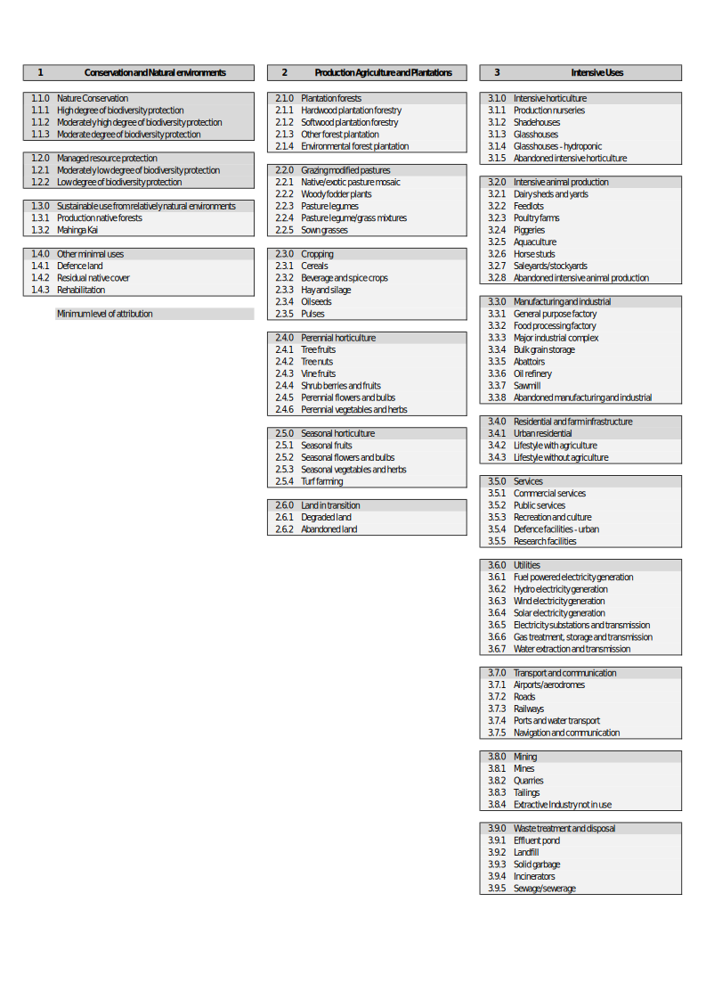

# New Zealand Land Use Management and Tenure (NZLUMT) Classification System 

Status: Draft
Version: 0.2
Developed by: Manaaki Whenua – Landcare Research

> Kotahi te aho ka whati, ki te kāpuia e kore e whati.
>
> One strand of flax is easy to break, but many strands together will stand strong.
> 
> — Kīngi Tāwhiao

<!-- ## TODO

- [ ] Temporality
- [ ] 1.1 and 1.2 model according to Bellingham 2016 and IUCN, as an equivalent to ALUM's CAPAD
- [ ] Hunting, open and restricted https://www.doc.govt.nz/map/index.html (management practice on conservation land?) e.g. `hunting`, `hunting open`, `hunting restricted`, `hunting prohibited` (restricted doesn't mean prohibited).
- [ ] Permanent forests under the ETS, https://www.mpi.govt.nz/forestry/funding-tree-planting-research/closed-funding-programmes/permanent-forest-sink-initiative/  3.1.4. Environmental Forest Plantation
- [ ] Carefuly review class definitions for application to New Zealand
- [ ] Add a note on tenure review process for crown leasehold land in the South Island

-->

## Overview

NZLUMT is an adaptation of the Australian Land Use and Management (ALUM) Classification (version 8) for application in New Zealand. Where direct overlap is considered appropriate, it is retained. If there is some degree of incompleteness in the specification, ALUM practice and guidance can be assumed to be applicable. ALUM is licensed under a [Creative Commons Attribution 3.0 Australia Licence](https://creativecommons.org/licenses/by/3.0/au), which explicitly permits adaptation of ALUM.

The NZLUMT is intended for the purpose of land use change modelling and environmental monitoring. Land use practices are of particular relevance to this classification system, as there is a need to understand social and economic capacity for changes to land management practices. Land tenure is also a compulsory attribute as it relates to the potential for changes to land use and land use management practices (i.e. tenure may constrain possibile changes).

<!-- TODO explicitly form some enduring questions that can be answered using this classification system -->

It balances simplicity of use with with flexibility and extensibility.

> Stiving to better, oft we mar what's well

— Duke of Albany, _King Lear_ (Shakespeare, 1606)

In other terms, the perfect is the enemy of the good. Implementations of this classification system should accept and record available yet partial information. For example, where it is clear that there is a plantation forest, but the intended _use_ of the timber (i.e. a commodity such as `pulp` or `sawlogs`) is _not_ apparent, the land use should still be attributed to an appropriate plantation forestry class, but the commodity value left as a null value. Record what is known, even where there are known information gaps.

Describing _how_ a classification is known is an important classification framework principle ("Priorite reproducible and transparent methodologies").

1. Through the recording of loose provenance information as part of the data schema (`source_data`, `source_data_doi`, `source_date`, and `source_scale`). This is not especially rigorous and is intended for rapid end-user information.
<!-- TODO 2. As a more rigourous but optional addition, describing classification logic using semantic techniques -->

## Hierarchical Classification System

1. **Conservation and minimal use of natural environments**

    This class includes land that has a relatively low level of human intervention. The land may be formally reserved by government for conservation purposes, or conserved through other legal or administrative arrangements. Areas may have multiple uses, but nature conservation is a central consideration. Some land may be unused as a result of a deliberate decision of government or landowner, or due to circumstance.

    Where a classification is made on the basis of information about legal protection, the relevant information (e.g. the Act) should be mentioned in the `comment` field.

    

Expand

    1. **Biodiversity protection**

        Tertiary classes 1.1.1–1.1.5 are based on the classification for areas legally protected for biodiversity, as proposedby Bellingham (2016, Tables 15-6, 15-7) <!-- TODO file:///home/lawr/Downloads/bellingham-etal_2016_standardised-terrestrial-biodiversity-indicators-for-use-by-regional-councils.pdf Table 15-7 -->

        1. **High degree of biodiversity protection** (Bellingham Rank 5); protection is the main purpose or is ranked equally with a limited number of other compatible purposes. Examples:
        - National Parks Act 1980
            - National Park
        - Reserves Act 1977
            - Nature Reserve
            - Scientific Reserve
        - Conservation Act 1987
            - Sanctuary Area
            - Wilderness Area
            - Wildlife Management Area
        - Resource Management Act 1991
            - Water Conservation Order
        - Wildlife Act 1953
            - Wildlife Sanctuary

        1. **Moderately high degree of biodiversity protection** (Bellingham Rank 4); protection is a main purpose but is shared with other, less compatible purposes (i.e. recreation). Examples:
        - Conservation Act 1987
            - Amenity Areas
            - § 23 Watercourse Area
        - Reserves Act 1977
            - Conservation Covenant
            - Protected Private Land
            - Scenic Reserve
        - Conservation Act 1987
            - Conservation Park
            - Ecological Area
        - Te Ture Whenua Māori Act 1993
            - Māori Reservation (Wetland or Scenic Reserve)
        - Queen Elizabeth II National Trust Act 1977
            - QEII Open Space Covenant
        - Wildlife Act 1953
            - Wildlife Refuge

        1. **Moderate degree of biodiversity protection** (Bellingham Rank 3); protection is a desired purpose but subject to capability with a different main purpose or may be less comprehensive (i.e. only some aspects of biodiversity protection are targeted). Examples:
        - Conservation Act 1987
            - Ecological Area
            - Stewardship Area
        - Reserves Act 1977
            - Government Purpose Reserve (Ecological or Wildlife)
            - Ngā Whenua Rāhui Kawenata
            - Local Purpose Reserve (Ecological)
        - Te Ture Whenua Māori Act 1993
            - Māori Reservation (Conservation or Conservation of Native Bush)
        - Wilidlife Act 1953
            - Wildlife Management Reserve

        1. **Moderately low degree of biodiversity protection** (Bellingham Rank 2); some biodiversity protection is achieved but it of secondary importance. Examples:
        - Resource Management Act 1991
            - Esplanade Reserve or Strip
            - Consent Notice (i.e. subdivisions granted subject to conditions to be complied with on a continuing basis by the subdividing land owner and subsequent owners)
        - Reserves Act 1977
            - Historic Reserve
            - Local Purpose Reserve (Other – various)
            - Recreation Reserve
        - Te Ture Whenua Māori Act 1993
            - Māori Reservation (various purposes related to Recreation, Camping, Water Supply, Meeting Places, Historic Significance, etc.)
        - Conservation Act 1987
            - Marginal Strip
        - Local Government Act 2002
            - Regional Parks

        1. **Low degree of biodiversity protection** (Bellingham Rank 1); protection results indirectly and fortuitously as a result of other actvities. Examples:
        - Te Ture Whenua Māori Act 1993
            - Māori Reservation (various purposes related to Marae, Pā Sites, Papakāinga, Urupā, Wāhi Tapu, etc.)
        - River Boards Act 1908
            - River Bed
        - Reserves Act 1977
            - Road Reserve

    2. **Cultural and natural heritage**

        1. Indigenous cultural heritage
        1. Cultural heritage
        1. Natural heritage

    3. **Minimal use from relatively natural environments**

        This class includes land that is subject to relatively low levels of intervention. The land may not be used more intensively because of its limited capability. The structure of the native vegetation generally remains intact despite deliberate use, although the floristics of the vegetation may have changed markedly. Where the native vegetation structure is, for example, open woodland or grassland, the land may be grazed.

        Where native grasses have been deliberately and extensively replaced with other species, the use should be treated under class 3.

        1. **Surface water supply**
        1. **Ground water**
        1. **Grazing native vegetation**

        1. **Production from indigenous vegetation**

        Commercial production from non-plantation native forests and related activities on public and private land. Environmental and indirect production uses associated with retained native forest (e.g. prevention of land degradation, windbreaks, shade and shelter) are not included in this class.

        This class includes wood production forestry on native timber without clearfelling, and other native forest production (non-sawlog or non-pulpwood production, including oil, wildflowers, firewood, fence posts, and mānuka/kānuka honey).

        1. **Customary use**

        Land with relativdely natural land cover, used for customary purposes. Includes food gathering practices from natural environments. This is often an ancillary use; this class should only be assigned to the `lu_code` if the customary practice is indeed the prime use of land (but it may often be listed as an ancillary use). If the use is done commercially, _and_ if the environment is considerably altered as a result of the practice, it should be classified under class 2.

        1. **Defence land**

        Natural areas allocated to field training, weapons testing and other field defence uses, predominantly in rural areas.

        1. **Environmental & infrastructure protection**
        1. **Carbon forest**

        <!-- TODO discuss "foraging" of natural environments as a potential use, e.g. seafood gathering, manuka honey, truffle, possibly hunting -->

    4. **Unused land and land in transiiton**

        Areas of land that are largely unused (in the context of prime use) but may have ancillary uses. This may be a deliberate decision by the land manager or the result of other circumstances. The land may be available for use but remain unused for various reasons.

        1. **Unused land** Land under native cover with no apparent prime use or where land use is indeterminate. Natural areas of transport corridors may fit under this class, along with unusable land such as cliffs, rock faces, boulders and tors, provided there are relatively low levels of disturbance. Where there is significant disturbance to the land (e.g. clearing) the area should be assigned to a different land use.

        1. **Land undergoing rehabilitation** Land undergoing rehabilitation that has been restored to a near natural state. Land that is degraded or undergoing rehabilitation but still substantially modified should be mapped under class 2 or 3.

    

2. **Production agriculture and plantations**

    This class includes land that is used principally for primary production. Native vegetation has largely been replaced by introduced species through clearing, the sowing of new species, the apre, lanplication of fertilisers or the dominance of volunteer species. The range of activities in this category includes plantation forests, pasture production for stock, cropping and fodder production, and a wide range of horticultural production. If there is evidence of irrigation infrastructure, it should have irrigation listed as a management practice even if irrigation water has not been applied in the current growing season.

    Fallow or ploughed land should be allocated to the relevant pasture, cropping or horticulture class (rather than using land in transition). Record the fallow or ploughed status in the management field.
   
    

Expand

    1. **Plantation forests**

        Land on which plantations of trees or shrubs (native or exotic species) have been established for production, or environmental and resource protection purposes. This includes farm forestry. Where planted trees are grown in conjunction with pasture, fodder or crop production, class allocation should be made on the basis of prime use.

        1. **Exotic plantation forestry**
        1. **Indigenous plantation forestry**
        1. **Other production uses**
        1. **Environmental & infrastructure protection** In contrast to class 1.3.7, this relates to _planted_ forests, rather than retained areas of natural forest.
        1. Permanent carbon forest

    2. **Grazing modified pastures**

        <!-- TODO Management practices: dairy wintering on/off, dairy support blocks -->
        
        Pasture and forage production, both annual and perennial, based on significant active modification or replacement of the initial vegetation.

        Land under pasture at the time of mapping may be in a rotation system, so that at another time the same area may be, for example, under cropping. Land in a rotation system should be classified according to the prime use (if known) or the land use at the time of mapping, with rotation information recorded in the management field. If the rotation sequence is known record this in the comments field. Effort should be made to distinguish a land use change from a rotation.

        If livestock or pasture type is known, record this in the commodity field.

        Some management practices relate to particular commodities. For example, `dairy cattle` (commodity) can be included alongside (`wintering off`) to describe a dairy farm system which practices wintering off (i.e. spring-autumn milking). These practices should be recorded if known; but it is acceptable to classify land under this class if management practices are indeterminate.
        <!-- Other relevant management practices in this case are: -->

        <!-- - `wintering off` -->
        <!-- - `feed pad`
        - `stand-off pad`
        - `herd home`
        - `composting barn`
        - `sacrifice paddock` -->

        1. **Dairy**
        1. **Intensive dry stock**
        1. **Extensive dry stock**

    3. **Short-rotation and seasonal cropping**

        <!-- Land that is under cropping. Land under cropping at the time of mapping may be in a rotation system, so that at another time the same area may be, for example, under pasture. Land in a rotation system should be classified according to the prime use (if known) or the land use at the time of mapping, with rotation information recorded as a management practice. If the rotation sequence is known record this as a comment. -->

        <!-- Cropping can vary markedly over relatively short distances in response to changes in the nature of the land and the preferences of the land manager. It may also change over time in response to market conditions. Production of fodder, such as lucerne hay, is considered cropping as there is no harvesting by stock. Strip cropping—where multiple commodities are cropped simultaneously—can be assigned to the secondary class 3.3 with multiple commodities recorded using the commodity field, and cropping strip in the management field. -->

        If the type of crop type is known, record this in the commodity field using the commodity list.

        1. **Arable cropping**
        1. **Arable and mixed livestock cropping**
        1. **Short-rotation horticulture**
        1. **Seasonal flowers and bulbs, and turf-farming**

    4. **Perennial horticulture**

        Crop plants living for _more than two years_ that are intensively cultivated, usually involving a relatively high degree of nutrient, weed and moisture control. If the crop type is known use the commodity list to record this. Management practices such as irrigation, or netting to protect crops from hail or birds can be recorded as management practices.

        1. **Tree crops** Includes tree fruits and nuts.
        1. **Vine fruits**
        1. **Other perennial horticulture** Including shrub berries, shrub fruits, flowers, bulbs, vegetables and herbs.

    5. **Intensive horticulture**

        Intensive forms of plant production (seasonal or perennial) often with special purpose improvements used for horticultural production. If crop type is known, record this in the commodity field. If crop type is known, record this in the commodity field.

        1. Production nurseries
        1. Glasshouses/shadehouses

    6. **Intensive animal production**

        Intensive forms of animal production (excludes associated grazing or pastures), livestock production facilities or animal-holding yards. If the animal type is known, record this in the commodity field. The management field can be used to record practices such as free range or milking system.

        1. **Animal containment** Includes dairy sheds, saleyards and stockyards
        1. **Poultry farms**
        1. **Piggeries**
        1. **Horse studs**
        1. **Aquaculture**
    
    7. Water and wastewater

        1. Stock water
        1. Effluent pond
        1. Water treatment - land application 
        1. Water treatment - wetland 
        1. Irrigation reservoirs and canals
    
    8. **Land in transition**

        Transitional, marginal areas where the land use is intdeterminate, or unknown and cannot reasonably be inferred from the surrounding land use. If possible, fallow or ploughed land should be allocated to a relevant pasture, cropping or horticulture class as this is the primary use. Land should previously have been used for agriculture or plantations to be classied under this secondary class.

        1. Unused degraded land
        1. No defined use
        1. Land undergoing rehabilitation
        1. Abandoned land

    

3. **Built environment**

    This class includes land uses that involve high levels of interference with natural processes, generally in association with closer settlement. The level of intervention may be high enough to completely remodel the natural landscape—the vegetation, surface and groundwater systems, and the land surface.

    

Expand

    1. **Residential**

        1. **High-density residential**
        1. **Medium-density residential**
        1. **Low-density residential**
        1. **Rural residential**

    1. **Public recreation and services**

        Land with houses and or other residential infrastructure with or without associated agricultural activity. This class includes urban and remote communities, farm buildings and other farm infrastructure larger than the minimum mapping scale, and land in transition to residential from other land uses. This class also includes holiday shacks.

        1. **Outdoor recreation**
        1. **Indoor recreation**
        1. **Community services**
    
    1. **Commercial**

        Land allocated to providing commercial services, resulting in substantial interference to the natural environment.

        1. **Retail**
        1. **Office**
        1. **Hospitality**
        1. **Entertainment**
        1. **Healthcare**
        1. **Transportation & warehousing**
    
    1. **Manufacturing and industrial**

        1. **General purpose factory**
        1. **Food processing factory**
        1. **Major industrial complex**
        1. **Sawmill**
        1. **Farm buildings/infrastructure**
        1. **Abattoirs**
    
    1. **Utilities**

        Land allocated to providing electricity, gas, or water.

        1. **Fuel powered electricity generation**
        1. **Hydro electricity generation**
        1. **Wind electricity generation**
        1. **Solar electricity generation**
        1. **Electricity substations and transmission**
        1. **Gas treatment, storage and transmission**
        1. **Water extraction and transmission**

    1. **Transport and communication**

        Land allocated to infrastructure used for transportation of goods or people, or navigation and communication equipment.

        1. **Airports/aerodromes**
        1. **Roads**
        1. **Railways**
        1. **Ports and water transport**
        1. **Navigation and communication**

    1. **Mining**

        Mining and extractive industries (excluding salt extraction from evaporation basins). Record the type of mining if known, from the commodity field.

        1. **Mines**
        1. **Quarries**
        1. **Tailings**
        1. **Evaporation basins**
        1. **Extractive industry not in use**

    1. **Waste treatment and disposal**

        Waste material and disposal facilities associated with industrial, urban and agricultural activities.

        1. **Landfills**
        1. **Transfer stations and recyling facilities**
        1. **Municipal wastewater**
        1. **Wastewater treatment - land application**
        1. **Stormwater management**

    1. **Vacant and transitioning land**

        1. **Vacant land**
        1. **Greenfield development**
        1. **Brownfield development**

    

## Tenure

Information relating to land tenure should be captured in two attributes: `land_estate` and `land_status`. How land is owned, and by whom, is an important consideration for how land may be used or managed. This information is included because it directly participates in the intended use of the land use classification system, though it is auxiliary.

### `land_estate`

Controlled vocabulary of types of tenure in New Zealand

- `freehold` or (to be more specific) `māori freehold`, i.e. estate in fee simple
- `leasehold` or (to be more specific) `crown leasehold` (e.g. a Crown pastoral lease)
- `cross lease`
- `stratum estate`, i.e. forms of unit title, according to whether land that has been subdivided was freehold or leasehold; `stratum estate in freehold`, `stratum estate in leasehold` (to be more specific)

### `land_status`

A non-exhaustive list of land status types organised along a gradient from Crown (public) to private.

<!-- TODO controlled vocabulary to describe these by reference to some systematic grouping -->

1. Crown
    1. Department of Conservation
    1. Territorial Local Authorities
        1. Regional councils
        1. Unitary authorities
        1. City councils
        1. District councils
    1. Offices of Parliament
    1. State services departments
        1. Public service departments
        1. Departmental agencies
        1. State services organisations outside the core public service, e.g.
            - NZDF
            - NZ Police
    1. Land Information New Zealand (LINZ), with respect to unallocated Crown land
1. Intermediate
    1. State-owned enterprises, e.g.
        - AsureQuality
        - Electricity Corporation of New Zealand
        - Kiwirail
        - Landcorp
        - MetService
        - Transpower New Zealand
    1. State-(part-)owned enterprises, e.g.
        - AgResearch
        - Air New Zealand (51.95% government ownership)
        - Christchurch Airport (25%)
        - Housing New Zealand Corporation
        - Landcare Research
        - Genesis Energy Limited (52.4%)
        - Mercury Energy (51.15%)
        - Meridian Energy (51.02%)
        - Scion
        - Plant & Food Research
    1. Non-SOE Crown-owned companies, e.g.
        - Crown Research Institutes
        - TVNZ
        - RNZ
    1. Universities
    1. Institutes of Technology and Polytechnics
    1. Wānanga (those that have been granted _Crown entity_ status)
    1. Council-controlled organisations (e.g. Ports of Auckland)
1. Private
    1. Businesses (corporations, companies)
    1. Trusts
    1. Families
    1. Individuals
    1. Iwi

## Water

Water is a land cover, rather than a land use. (If it is considered "land" at all.) Certain land uses can only occur on water (e.g. aquaculture); some can occur on either land or water (e.g. oil and gas wells); some only on land (e.g. pastoral farming)—but pieces of such land may include water, e.g. dams, ponds, and lakes.

ALUM classifies water as a primary class, but notes that this presents some difficulty. NZLUMT specifies instead that water is to be recorded as a distinct attribute that can be applied to a geographic unit.

Very often water doesn't occupy the entire geographic unit (i.e. parcel); it should still be discriminated accurately as a sub-parcel-scale feature. The exception is if it is very small, in which case it can be ignored rather than attributed to the entire parcel.

The "water" field can take one of the following values:
    - `lake`
    - `reservoir`
    - `dam`
    - `evaporation basin`
    - `river`
    - `channel`
    - `aqueduct`
    - `wetland`
    - `estuary`
    - `intertidal` <!-- supralittoral, eulittoral -->
    - `marine` <!-- sublittoral -->

## General issues

### Geographic scale

The intended geographic unit of this classification system is the property parcel. However it may be appropriate to map sub-parcel geographic entities for particular classes, particularly if the boundary of natural features (forests, waterways) is pertinent, if the parcel is very large, and where source data scale permits such definition. Whether to map sub-parcel areas is therefore left to operator discretion, but the intended and minimum level of attribution is the property parcel, and therefore property parcel identifiers and geogaphic boundaries must be present in output land use data.

### Temporality

<!-- Interannual. A crop planted for a whole year is a commodity, but not neccessarily a land use e.g. if it's part of livestock farm system... primary economic purpose is the determining factor for landuse class -->

## Data specifications

### Data structure

<!-- TODO make example realistic, e.g. coherent class examples -->
| attribute | type | example | notes |
| --- | --- | --- | --- |
| lu_coden | integer | `123` | Numerical land use code (primary use)|
| lu_code | string | `1.2.3` | Land use code (primary use) |
| lu_description | string | `Groundwater` | Land use class label (primary use) |
| lu_code_ancillary | string | `2.2.0, 3.2.1` | Land use code (ancillary uses), multiple uses are to be specified with comma separation with optional whitespace characters |
| commod | string | `cattle dairy` | Commodity type; multiple commodities are to be specified with comma separation with optional whitespace characters |
| commod_ancillary | string | `pulpwood` | Commodity type(s) relating to the ancillary land use code(s) |
| manage | string | `irrigation spray, organic` | Management practices; multiple practices are to be specified with comma separation with optional whitespace characters |
| manage_ancillary | string | `free standing` | Management practices relating to the ancillary use code(s)
| land_estate | string | `freehold` | Estate type |
| land_status | string | TBD | Land status type (public-private continuum) |
| water | string | `lake` | Water type (null for land) |
| confidence | integer | `3` | Confidence 1-4, a qualitative assessment relating to the overall operator confidence in the assigned classification |
| luc_date | date | `2024-05-26` | Date of (primary) land use code |
| source_data | string | `Northland Regional Council` | Primary source data (e.g. field mapping, local knowledge, ancillary dataset, air photo, imagery). Often, multiple sources of information are combined to come to a conclusion; only ony should be specified. |
| source_data_doi | uri | `doi:10.26060/W5B4-WK93` | Optional (i.e. when available) DOI or HTTP URI for the source data |
| source_date | date | `2023-12-01` | Date of spatial featue (e.g. image date, ancillary photo date) in primary source data |
| source_scale | string | `1:25000` | Scale of primary source data

### Data format and spatial referencing

Vector data format: [GeoPackage](https://www.geopackage.org/) v1.4.0 or later and/or [GeoParquet](https://geoparquet.org/) v1.0.0 or later.

Raster data (or other formats) _may_ be produced for user convenience, but no particular format is specified, due to the lack of wide acceptance of a raster data format with support for attribute tables. Vector data is mandatory, however.

Coordinate system: any [current official projection](https://www.linz.govt.nz/guidance/geodetic-system/coordinate-systems-used-new-zealand/projections) may be used:

- New Zealand Transverse Mercator 2000 (NZTM2000).
- NZGD meridional circuits (e.g. for regional extracts) or offshore island projections.
- New Zealand Continental Shelf Lambert Conformal 2000 (NZCS2000).

# References

Bellingham PJ, Overton JMcC, Thomson FJ, MacLeod CJ, Holdaway RJ, Wiser SK, Brown M, Gormley AM, Collins D, Latham DM, Bishop C, Rutledge DT, Innes JG, Warburton B 2016 Standardised terrestrial biodiversity indicators for use by regional councils. Landcare Research Contract Report LC2109 prepared for Regional Councils' Biodiversity Monitoring Working Group, Auckland Council, Auckland, New Zealand.